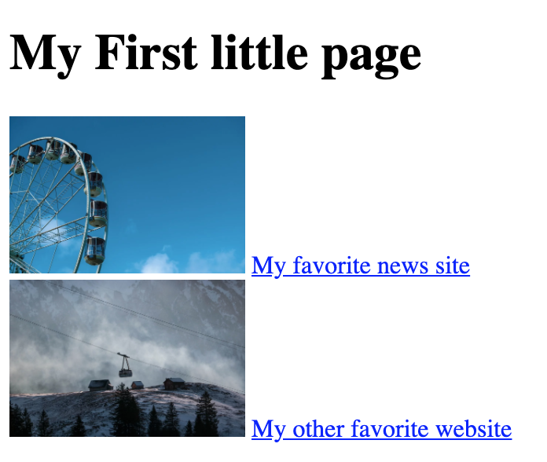
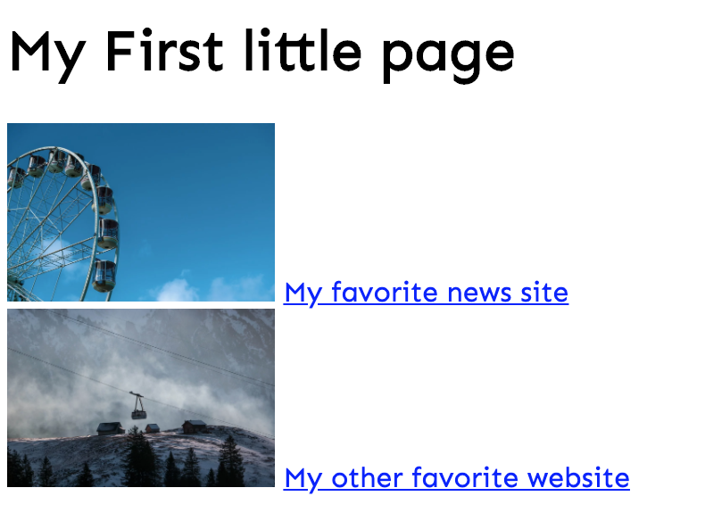
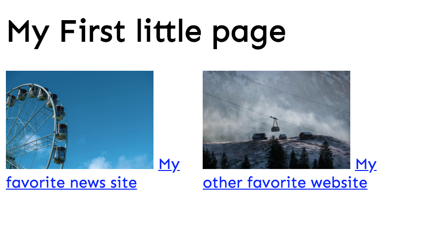

# Combine images and links with a minimal layout

## Help

- [Questions to this exercise](http://askbot.greenfox.academy/questions/tags:combine-images-links/)

## The Overview

- Create a new pen on Codepen to work with
- You'll create this step by step (but you can give it a try on your own):
  - font: `Sen`
  - images: `150px` and they're the same as before


## Step by Step

To create the HTML structure let's first imagine the boxes. What will have to be in a container box? What elements are styled together somehow? There's the whole box that will be a container, you can use the `main` tag for that. Then there's the title very distant from the other elements, it'll be probably just on it's own. If you look at the rest you can see that the image and the link is centered compared to each other. So one image and one link has to be in one box. You can use the `section` tag to put them together. If they have to be in a box (using the `section` or any other container tag), that's going to be `block` element, so in order to put them next to each other we can put these two `sections` in another container, for example `div`. So the structure will look something like this:

- `main`
  - `h1`
  - `div`
    - `section`
      - `img`
      - `link`
    - `section`
      - `img`
      - `link`

When creating the HTML structure don't forget to close the tags.

### Create the HTML structure and set the images width to `150px`



### Insert a font you like



In order to put the two `sections` next to each other we already learned that the `display: inline` can sometimes work. That works best for only simple texts, but in this case there's an image and a text. So it's not going to work quite well. Using flexbox it's very easy to put them next to each other. By default flexbox put elements in a `row`. Setting up this needs to happen on the container element, in this case the `div` if you followed the above structure. If you want to use flexbox you can set the `display` property to the `flex` value on the container.

```css
div {
  display: flex;
}
```

### Set the `display` to `flex` on the container of the two sections and set the `width` of the `section`s to `200px`



Now the only problem left is the that the links are starting next to the images and they are not centered.
The reason behind the first one is that the links are `inline` elements. If you change them to `block`, they're going to be placed on a new line. Now the `text-align: center` will center the image and the link as well, if you set it for the `section`.

### Make the links to be `block`s and `center` the text in `section`s


## [Solution Pen](https://codepen.io/adamgyulavari/pen/JjdzqPJ)

