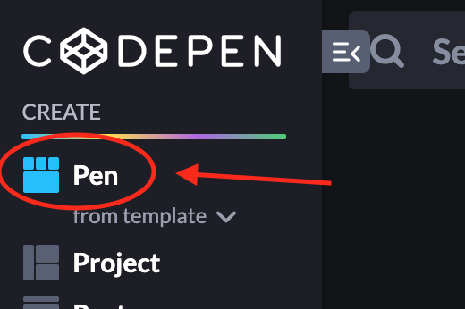
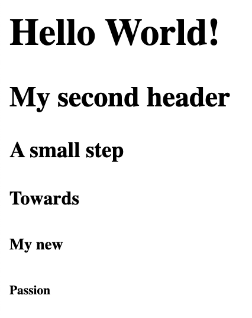
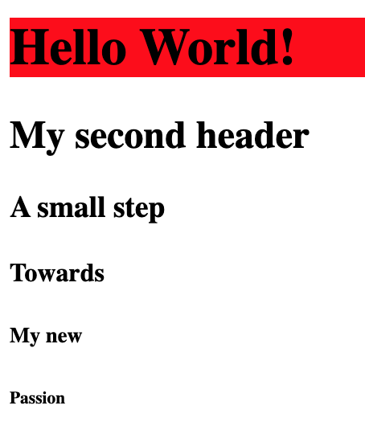
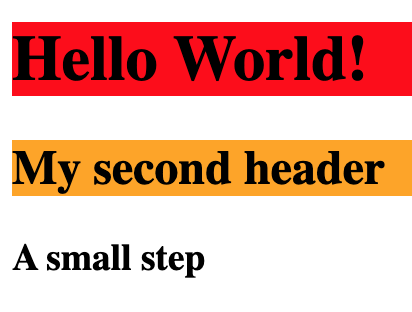
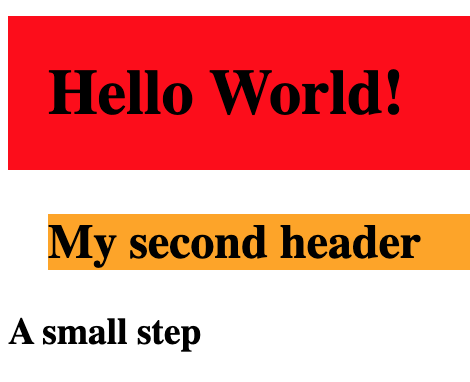

# Create a new pen and use headers

## Help

- [Questions to this exercise](https://stackoverflow.com/c/greenfoxacademy/questions/tagged/15)

## 1. Create a new pen

- Click on the Codepen logo on the top left


- Click on the create Pen on the top left



- Now you should have a new empty workspace
- You can change the name of the pen from `Untitled` to `Use headers` or anything you like

## 2. Create header tags in HTML

Any HTML tag will start with `<` sign, then comes the name of the tag, like `p`, `div` or `h1`. After that there can be some attributes (eg. `class="first"`) and then closing it with the `>` sign.

```html
<p>
```

Some tags can stay on their own like that, but most of them will have some content, so the tag will have a closing pair:

```html
<p>This is the content</p>
```

The content can be a simple text but also one or more tags.

### Create an `h1` tag with the content: `Hello World!`


### Create all other header tags (`h2`-`h6`) with any content you like



## 3. Create your first CSS rules

Any CSS ruleset will start with a selector to specify the elements you'd like to style with the rules. A selector can be simply any tagname like `h1` or `p`, but it can be many more, let's use tagnames for now. After the selector comes a `{` sign then the styling rules and closing the whole thing with a `}` sign. So this is an empty CSS ruleset:

```css
p {
  
}
```

The styling rules (they are called declarations) consists of a property (eg. `background`) and a value (eg. `red`) separated with a colon `:` and closed with a semicolon `;`. You can have only one or more of them in one ruleset.

```css
p {
  background: red;
}

div {
  background: orange;
  padding: 20px;
}
```

The `margin` and `padding` properties are going to set the distance between the styled tag and other tags. The `margin` is an invisible outer distance, while the `padding` will have the `background` of the tag.
There are many properties that you can set a value to and the value has to be valid for the property. You can set `margin` for example with any number value (with a unit like `px` or `%`) but you can't set the `margin` to be `orange`.

### Style the first header's `background` to be `red`

- The whole line is going to be red, but that's how it should be for now



### Style the second header's `background` to be `orange`



### Add `padding` to the first and the `margin` to the second header to see the difference


