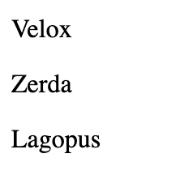
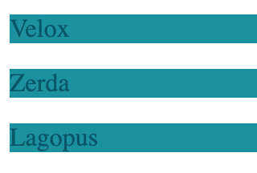
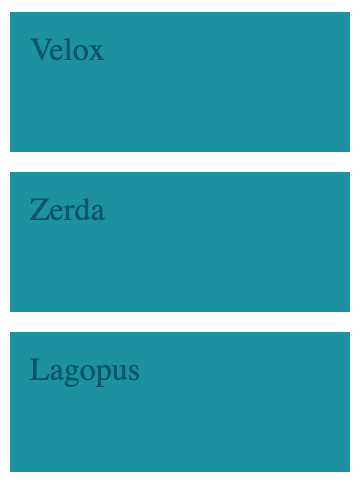
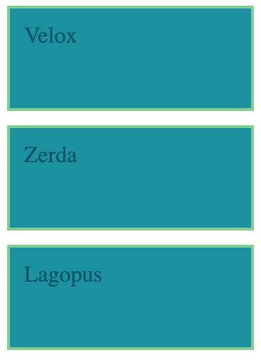
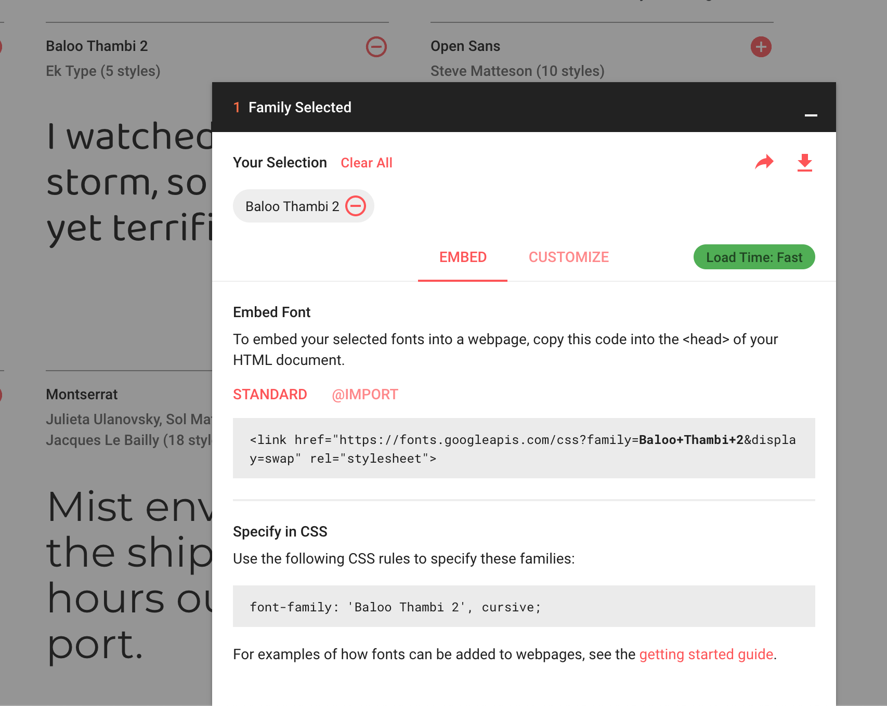
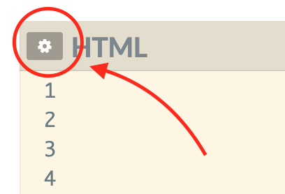
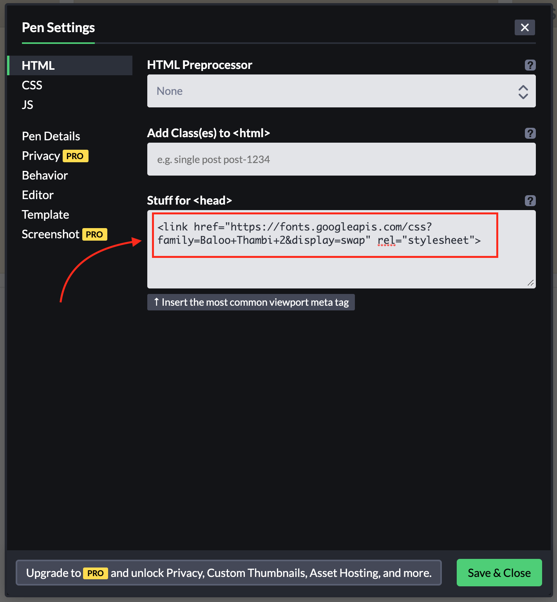

# Velox Zerda Lagopus

## Help

- [Questions to this exercise](https://stackoverflow.com/c/greenfoxacademy/questions/tagged/9)

## The Overview

- Create a new pen on Codepen to work with
- You'll create this step by step (but you can give it a try on your own):


## Step by step

For this exercise you can choose to use almost any tags that can have a content. You should use the same tag for all 3 elements since the styling of them is the same.

### Create the HTML structure with `p` tags



There is another way to use colors than using the name of it. There are many-many colors and not all of them are named. So instead of the color name `red`, you can use the HEX value for the red color that is `#FF0000`. This way you can use any color a computer can display. The hashmark `#` indicates that this is a HEX color value. The computer can display the colors by mixing tiny lights of `red`, `green` and `blue` for every pixel on your screen. The first 2 characters of the numbers are the amount of `red` to be used, then 2 for `green` and 2 for `blue`. RGB, right? Each of them are a 2 digit hexadecimal number, so the lowest value is `00` (meaning no need any of this part in the mix) and `FF` is the highest (put in everything you got). But you can easily find color codes on the internet with a quick Google search.
The property to change the color of the text is called `color`.

```css
p {
  color: blue;
}
```

### Create a CSS ruleset for the `p` tag and set the `background` to `#0D91A1` and the text's `color` to `#015668`



You can set the length of boxes by setting a rule for the `width` of the `p` tags. The `width` property can have any number value with a unit like `300px` or `50%`. The same goes for the `height` property to control the height of the box.

```css
p {
  width: 300px;
}
```

These boxes in HTML have 3 surrounding layers around the content. You already know the `padding`, which is still part of the box, this is why the `background` is visible on it. Then comes the `border` and finally the outer `margin`. All of them can be set individually for the 4 sides of the box (`top`, `right`, `bottom`, `left`) and together like we did before. They have separate properties to use, but it is possible to put multiple values for the shorter general property (that is called shorthand).

```css
.shorthand-for-all-sides {
  padding: 10px;
}

.different-sides {
  padding-top: 10px;
  padding-right: 20px;
  padding-bottom: 30px;
  padding-left: 40px;
}

.shorthand-for-different-sides {
  padding: 10px 20px 30px 40px;
}

.shorthand-vertical-horizontal {
  padding: 10px 20px;
}
```

### Set the `width`, the `height`, `padding` and `margin` for the `p` tag



The `border` comes between the `margin` and the `padding` in the box-model. It surrounds the content and the padding and it is inside of the margin. To set the border, you need to specify 3 values, the `width` of the border (eg. `5px`), the `style` of it (eg. `solid`) and the `color` (eg. `black`).

```css
p {
  border: 5px solid black;
}
```

But you can specify the borders individually for the sides (`border-top`, `border-right`...). And also the parts separately like `border-width`, `border-style` and `border-color`. You can also combine these to be even more specific.

```css
p {
  border: 5px;
  border-style: solid;
  border-left-color: orange;
}
```

In the above example the order matters, the most general should be at the top and the most specific and the bottom. Otherwise the general shorthand `border: 5px` would override every border related rules we defined before.

### Set the `border` for the `p` tag

- You can use this color: `#7DCE94`



The only thing left is to set the font properly. You can use properties for this that starts with `font-`. For example `font-size` to control the size of the text and `font-family` to choose what font should be used.

The default font is `Times New Roman` but we can also use it's general category `serif` (because of typography) which is going to be the same. You can use any font that is on your computer, but that's only going to work on your computer and not on others (who might not have those fonts installed).

To use a different font but still ensure it's going to be available on every computer you can use general categories (`serif`, `sans-serif`, `cursive`, `system-ui`, `monospace`...). Or you can load a font from the internet, for example from https://fonts.google.com/

You can select a font family with the red `+` sign at the top right corner of the fonts. Then open up the panel from the bottom right.



You need to copy the `<link>` tag and put it into your HTML's `<head>` tag. On Codepen you will find it under the settings of the HTML tab:



Then just paste it into the proper field.



Save & Close it. The font is loaded and now you can use it in CSS with the same line specified on Google Fonts.

```css
p {
  font-family: 'Baloo Thambi 2', cursive;
}
```

### Set the font to any Google font you like


