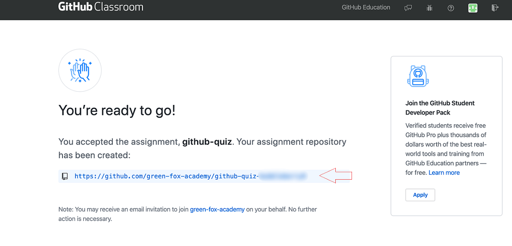
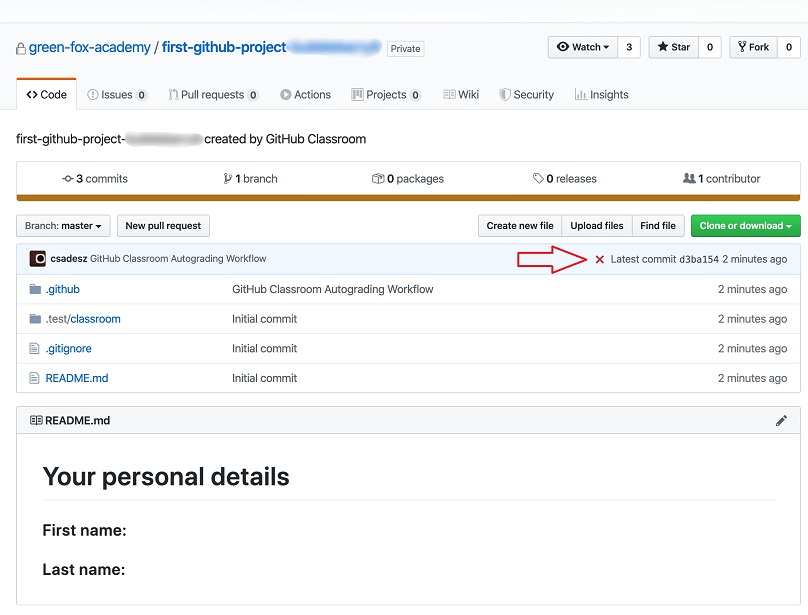
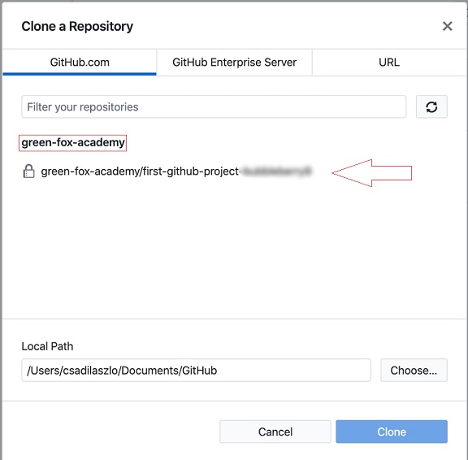

# Clone your assignment

## Help

- [Questions to this exercise](https://stackoverflow.com/c/greenfoxacademy/questions/tagged/#)

## Introduction

There is an [Invitation link to GitHub Classroom](https://classroom.github.com/a/1aIPRJVL), which generates you a new repository.
  - First you should authorize the organization
  - And Accept the assignment

After these steps and a 'loading screen', you will able to see a page like that:



**Check the red cross**



**It means some tests are failed. Your exercise is to follow the steps below, and make it a green tick!**

## Step by step

### Clone the repository and open it
> You can clone the generated repository via GitHub Desktop. Now you don't want to create a new repository, you would like to use an existing one.

Find the `Clone Repository` option, and clone what was generated inside the **green-fox-academy** organization.
You will find something like this, clone it:



Open the project with Visual Studio Code

### Edit
Open the `README.md` file
- Add your first name and commit one with a meaningful commit message like: _Add first name_
- Do the same with your last name


### Check it
- Push these commits to the origin
- Check: Is there a green tick or a red cross for your commit in your origin repository?
  
If you see a yellow dot more than a minute just refresh the page.


### Edit more 
Let's **bold** the correct answers for the quiz questions!

```markdown
## Which is true?
- false
- false
- **true**
- false
```

In GitHub it will seem like that:

## Which is true?
- false
- false
- **true**
- false

### Check it again
- Push these commits to the origin
- Check: Is there a green tick or a red cross for your commit in your origin repository?