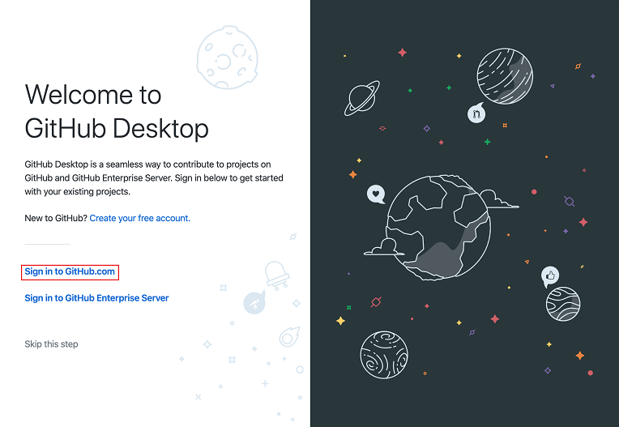
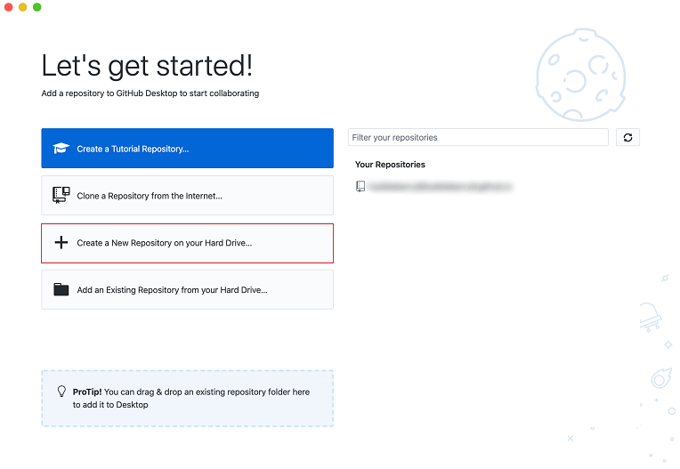
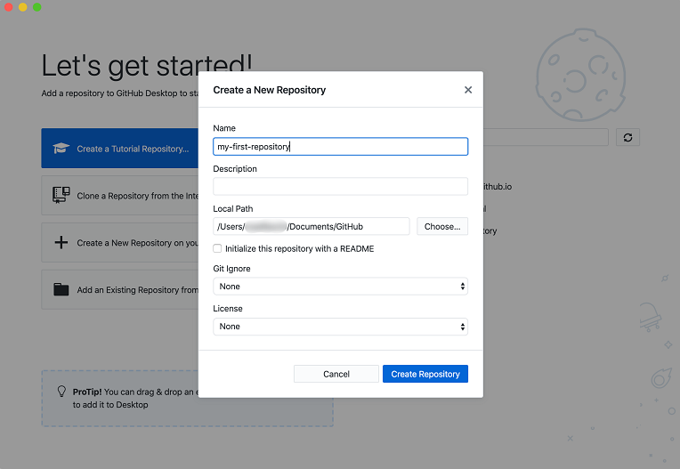
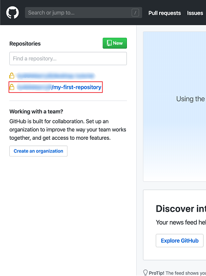
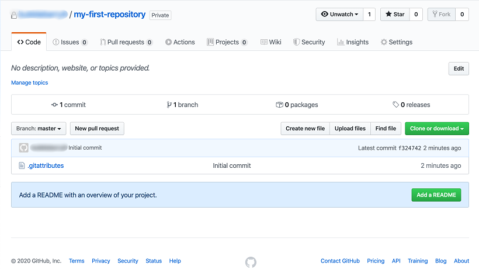
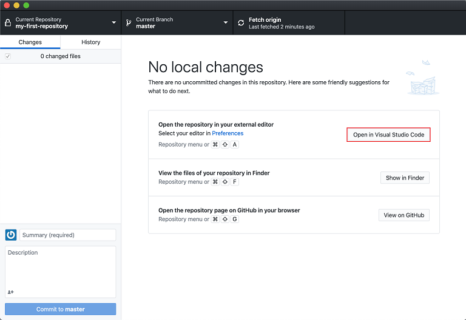
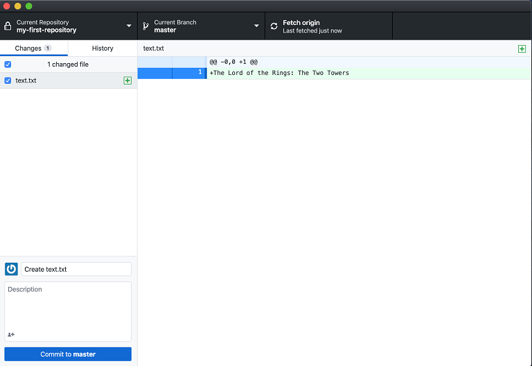
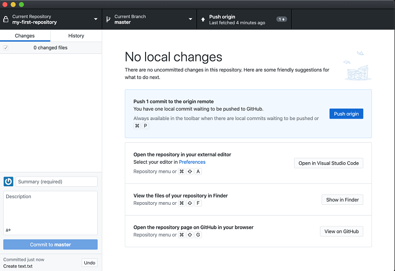
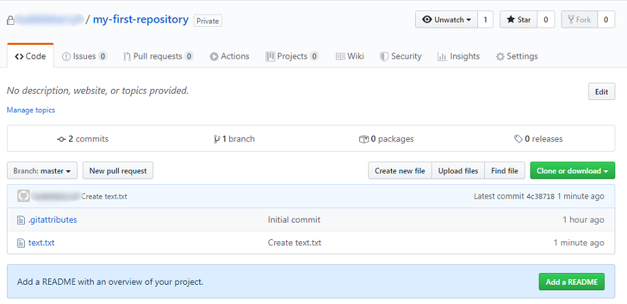

# Your first repository

## Help

- [Questions to this exercise](https://stackoverflow.com/c/greenfoxacademy/questions/tagged/first-repository)

## Step by step

Run the downloaded GitHub Desktop application and sign in with your GitHub account

Create a new repository and name it as `my-first-repository`

Publish this repository to GitHub, untick 'Keep this code in private'!

Visit [GitHub](https://github.com/)

- Sign in if it is necessary
- Check your fresh and new repository
- It should have 1 commit, and just an `.gitattributes` file

Now go back to the Github Desktop app, and open the repository's folder with Visual Studio Code

- Create a new file
  - Name it as `text.txt`
  - Type in your favourite movie's title and save it

In the Github Desktop app you can see the changes

Commit the changes to the master

Push that commit to the origin

Check your origin repository again, and make sure your text file is there

