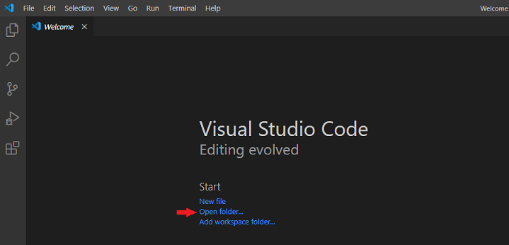

# Visual Studio Code first steps

> You will be introduced to the VSCode editor on how to create HTML, CSS files.

## Help

- [Questions to this exercise](https://stackoverflow.com/c/greenfoxacademy/questions/tagged/#)

## Step by step

### Folder structure

Run VSCode and open a folder where you would like to work. (Documents, Desktop, etc.)



Create a new folder and name it as **Greenfox**.


Make one more inside the **Greenfox** folder and name it as **vscode-practice**.

### Create new files

Create an `HTML` and a `CSS` file in the **vscode-practice** folder.
  - For the sake of simplicity you can name these files like
    - `index.html`
    - `style.css`
  - When you create a new file, make sure you give the correct extension! (.html, .css, .txt, etc.)


### Edit files

- Click on the `index.html`, it should be an empty file
- Start typing *html* and a pop-up window will appear
  - Select the `html:5` option

```html
<!DOCTYPE html>
<html lang="en">
<head>
  <meta charset="UTF-8">
  <meta name="viewport" content="width=device-width, initial-scale=1.0">
  <title>Document</title>
</head>
<body>
  
</body>
</html>
```
- Add a `<p>` tag inside the body with some text
- Add this reference line in the HTML's `<head>` to include CSS

```html
  <link rel="stylesheet" type="text/css" href="style.css"/>
```  
- Click on the `style.css` and add some basic CSS like:

```css
p {
  color: red;
}
```

### Check in your browser

You can open your `index.html` with your browser, and you can see your HTML page
  - It should be a red text
  - If something is wrong, check that you saved all the files you edit before!
    - VSCode doesn't save your changes automatically, you should click on **File -> Save**, or use the shortcut (on Windows is **Ctrl+S**)
  - If you don't want to save manually your changes all the time:
    - Go to **File -> Preferences -> Settings**
    - **Search settings** and write in: *Auto Save*
    - Choose the option that works for you (afterDelay, onFocusChange, onWindowChange)

Change the content and the colour, and check it again! If you don't close it, all you have to do is refresh the page.

### Live Server

> You get a lot of opportunities with VSCode to customize it according to your needs. 
> It has a marketplace where you can install several extensions.
> That is what we going to do! 

We install an extension called 'Live Server' which has the advantages of:
- Open an HTML file to browser from VSCode
- Don't have to refresh the page all the time, it happens in real time after changes


After installation open with Live Server, and make some more changes, check how it works.


### Export codepen project